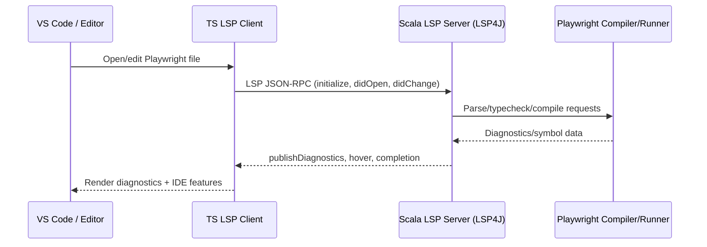

# Playwright LSP Extension

This repository contains a Language Server Protocol (LSP) implementation for the Playwright programming language. It includes a Scala-based LSP server and a TypeScript-based VS Code client used to connect editors to the server.

## High-level architecture



At a glance:
- The **VS Code client** (TypeScript) starts and manages the server process, forwarding editor events as LSP JSON-RPC messages.
- The **Scala LSP server** handles parsing, analysis, and LSP responses using LSP4J for protocol plumbing.
- The server delegates to the rest of the Playwright backend for parsing, validity checking, typechecking, linking, and the interpreter in order to provide semantic information used in diagnostics or editor features.

## Project layout

- `scala_lsp_server/` — Scala 3 LSP server implementation (sbt project)
- `ts_lsp_client/` — VS Code extension client (TypeScript)
- `lsp_spec.html` — Local copy of the LSP specification

## Prerequisites

Install the following before building:

- **Java JDK 17+** (required for LSP4J and running the server)
- **Scala 3**
- **sbt** (Scala build tool)
- **Node.js 18+** and **npm** (for the TypeScript client)
- **VS Code** (optional, for running the extension)

## Build and rebuild steps

### Full build (server + client)

```bash
cd scala_lsp_server
sbt clean compile
make lsp-jar

cd ../ts_lsp_client
npm install
npm run compile
```

### Rebuild after changes

- **Server only**
  ```bash
  cd scala_lsp_server
  sbt compile
  make lsp-jar
  ```

- **Client only**
  ```bash
  cd ts_lsp_client
  npm run compile
  ```

## Debugging the VS Code extension

The repository includes a debug launcher in `.vscode/launch.json` for testing the extension in a fresh VS Code window.

1. Build the server and client (see build steps above).
2. Open the repo root in VS Code.
3. Open the **Run and Debug** panel and select the **Launch Client** configuration.
4. Press **F5** to start debugging. VS Code will open a new **Extension Development Host** window where you can test the extension.
5. Log messages will be tracked in the console output in *Toy LSP* or *Toy LSP Trace* panels

## Useful resources

- [Language Server Protocol specification](https://microsoft.github.io/language-server-protocol/specifications/lsp/3.17/specification/)
- [LSP4J](https://github.com/eclipse/lsp4j)
- [vscode-java](https://github.com/redhat-developer/vscode-java)
- [Eclipse JDT LS](https://github.com/eclipse/eclipse.jdt.ls)
- [CS4400 (Felleisen) website](https://felleisen.org/matthias/4400-f25/index.html)

## Additional notes

- The LSP client in `ts_lsp_client` is based on the minimum viable VS Code LSP extension starter.
- The local `lsp_spec.html` file can be opened in a browser for an offline copy of the protocol spec.
